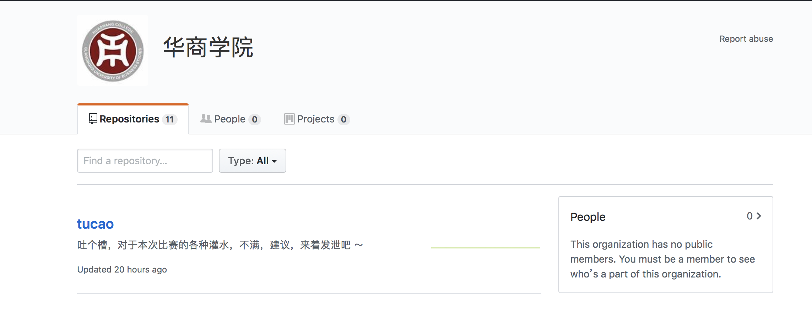
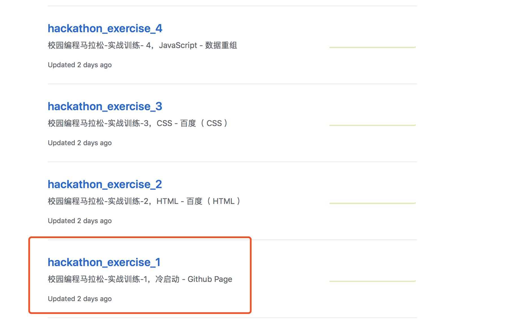
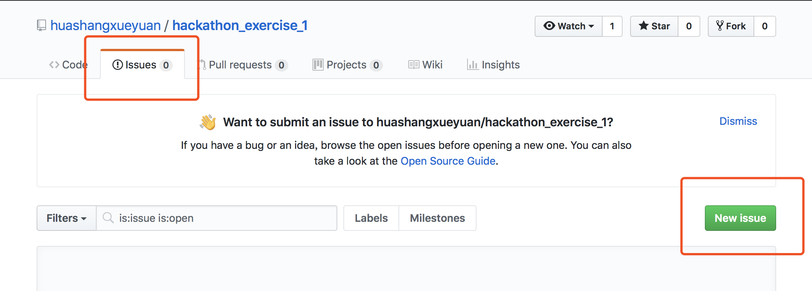
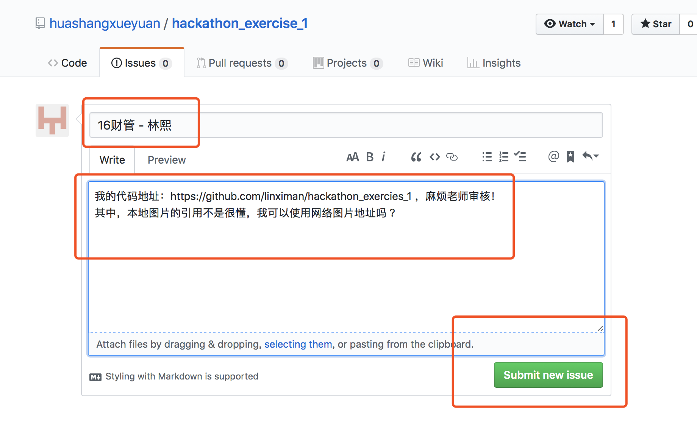

# 第一届校园编程马拉松

编程，是什么？或许有很多同学还不了解编程是什么，并且和专业及以后的方向也感觉没什么相干。 其实编程就像旅行一样，有时候并不能走遍世界，但却能走出内心的孤独。希望在这一个月的马拉松时间，大家对编程有一个自己的认识，对自己也有一个新的认识。

课程和任务设计面向的全体学生，零基础的学生并不需要担心有老司机占道，只要大家认真用心的完成每一次任务，都有机会获得奖品。当然我相信同学们更关注的是自身能力的确切提升，同时希望老司机可以安全又炫酷，让更多的同学认识编程。

本次马拉松有 6 个实战训练及 4 个赛事任务。同学们可以更具自身的时间安全进行实战训练，实战训练不要求同步进行，好比马拉松跑得有快的和慢的。赛事任务将定期进行，可以理解为马拉松中的能源补给，目的是帮助所有参赛选手都能跑完全程。

## 学习交流

为了避免广告，请参赛同学扫码添加微信号（ aitcoder ）或扫描以下二维码加群，请备注 : 年级班别-姓名( 16财管 - 林熙 )。群里有多名辅导老师，在学习过程中遇到的问题，都可以在群里面交流，同时赛事通知及奖品都会在群里选出。所以，请参数选手务必添加微信号加群。

## 实战训练

1. 注册 Github 账号
2. 使用 Github 账号登录 AitSchool 学习平台（ [https://www.aitschool.com](https://www.aitschool.com) ）
3. 进入 校园马拉松专项页面，点击查看大纲可以看到本课程需要学习的和实战训练内容。
4. 根据课程中视频、图文进行学习，有不懂的地方可以随时在微信群中交流。
5. 完成实战训练，在华商学院 Github 组织的对应仓库的 issues 中提交。
6. issue 提交 title 格式为：班别-姓名。descript 格式为你的代码仓库地址 + 你的疑惑或者你想对辅导老师说的话。
7. 辅导老师将根据 issues 中提交的仓库进行克隆和点评，点评后的 issue 将会被暂时关闭。

## 赛事任务

1. 每周三将公布赛事任务内容，及上一个赛事任务的答案
2. 完成赛事任务，在华商学院 Github 组织的对应仓库的 issues 中提交。
3. issue 提交 title 格式为：年级班别-姓名（16财管-林熙）。descript 格式为你的代码仓库地址 + 你的疑惑或者你想对辅导老师说的话。
4. 辅导老师将根据 issues 中提交的仓库进行克隆和点评，点评后的 issue 将会被暂时关闭。

## 训练和任务的提交示例

1. 登录 华商学院 Github 组织 [https://github.com/huashangxueyuan](https://github.com/huashangxueyuan)

2. 选择本次提交训练/任务的提交仓库，训练带有 exercies 前缀，任务带有 round 前缀 ，以下图片使用「 实战训练 - 1 」为例子

3. 点击仓库中 Issues 的标签，然后点击 New Issue ，添加 issue 。

4. issue 的 title 标题为：班别-姓名( 16财管 - 林熙 )，方便以后筛选查看自己 issue 的评论。write 内容 为你的代码远程仓库地址，导师将更具你的远程仓库地址去审查你的代码。

## 现场辅导

在学习过程中，更具实战任务，但是还是不能完成赛事任务的同学，每周六将邀请「 极客学院 - 前端研发负责人 」为大家现场讲解和演示。希望同学带着疑问过来，并有所收获。

## 吐个槽

吐个槽，对于本次比赛的各种灌水，不满，建议，点击本仓库的 Issues 发泄吧 ～
